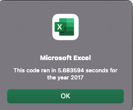
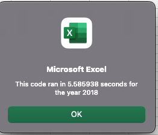
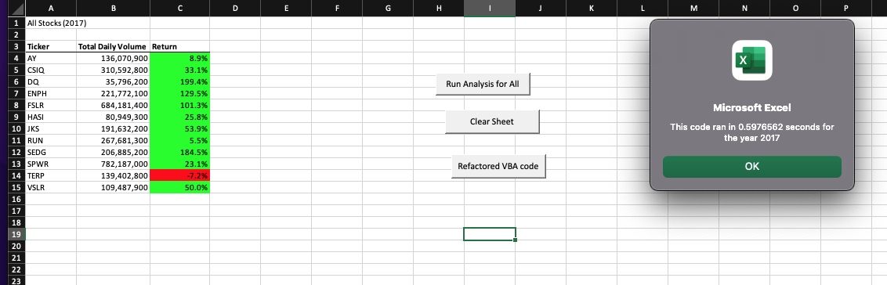
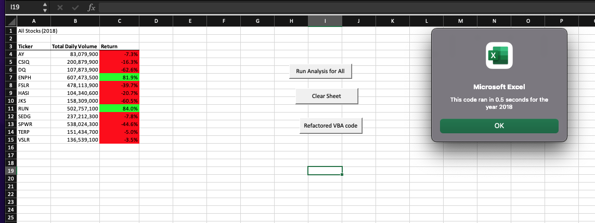

# Stock-Analysis (2017 and 2018)
## Overview
- I am helping Steve analyze stocks for his parents and decide what stocks are worth investing in by comparing how the stocks did in 2017 and 2018. In order to achieve this, I found a way to formulate a button through macros that will give us the total daily volume and yearly return. Since a button was created, I edited the macro to run through all the stocks instead of a select few (12) in order to increase the user's avibility to analyze and greater amount of stocks at once.
- The purpose of this challenge is to recode the original VBA code in order to make it perform faster by optimizing the code while having it run efficiently.

## Results 
- The following are the timer results from the original Macros that were created through the module 2. These are 2017 and 2018 respectively.
 
               

- The following pictures are from the new code that I refactored in order to make the run time faster, these pictures include the analysis for their respective years as well as the run time from the refactored VBA code. 

#### Refactored 2017 timer and 2017 Analysis

#### Refactored 2018 timer and 2018 Analysis

- Its great that my VBA code was able to run A LOT faster and smoother after it was refactored. However, the objective is to help my friend Steve figure out what stocks his parents should invest in. Now am I a little bias because I have a finance degree? Sure I am! Although through 2017 and 2018 only two stocks showed that they are profitable there is just not enough to state which stocks his parents should invest in. There are for sure a few stocks that already seem like a bad idea to invest in such as JKS and DQ but as for which stocks are worth it all depends on risk aversion and how much his parents are willing to lose in order to have a higher posible return. ENPH and RUN seem like good stocks for longterm hold, a few of these stocks show a high volatility which can scare off Steve's parents from investing in them.

## Code Explanation

 - Below I creater a variable called tickerIndex in order to use in the following 3 arrays I created to hold the Volume, Starting price and End price. This will aid in building the yearly return. I also createed a loop that will go over all the row to pull the values that allign with the ticker index.
    
       'Get the number of rows to loop over
       RowCount = Cells(Rows.Count, "A").End(xlUp).Row
    
       '1a) Create a ticker Index
       Dim tickerIndex As Single
       tickerIndex = 0
    

       '1b) Create three output arrays
       Dim tickerVolumes(12) As Long
       Dim tickerStartingPrices(12) As Single
       Dim tickerEndingPrices(12) As Single
    
       ''2a) Create a for loop to initialize the tickerVolumes to zero.
        For i = 0 To 11
       tickerVolumes(i) = 0
       Next i
       ''2b) Loop over all the rows in the spreadsheet.
       For i = 2 To RowCount
    
    - This is the futher lines of the loop that will go over the rows the pull the necessary values in order to achieve the outcome I desire.

          '3a) Increase volume for current ticker
        
          tickerVolumes(tickerIndex) = tickerVolumes(tickerIndex) + Cells(i, 8).Value
        
          '3b) Check if the current row is the first row with the selected tickerIndex.
      
          If Cells(i, 1).Value = tickers(tickerIndex) And Cells(i - 1, 1).Value <> tickers(tickerIndex) Then
         
          tickerStartingPrices(tickerIndex) = Cells(i, 6).Value
            
            
          End If
        
          '3c) check if the current row is the last row with the selected ticker
          'If the next row’s ticker doesn’t match, increase the tickerIndex.
          If Cells(i, 1).Value = tickers(tickerIndex) And Cells(i + 1, 1).Value <> tickers(tickerIndex) Then
        
          tickerEndingPrices(tickerIndex) = Cells(i, 6).Value
        
            
            

            '3d Increase the tickerIndex.
           tickerIndex = tickerIndex + 1
            
          End If
    
          Next i  
          
     - Finally I assigned the cells to pull the volumes and it will also give me the return for each stock. 

           '4) Loop through your arrays to output the Ticker, Total Daily Volume, and Return.
           For i = 0 To 11
        
           Worksheets("All Stocks Analysis").Activate
        
           tickerIndex = i
    
           Cells(i + 4, 1).Value = tickers(tickerIndex)
           Cells(i + 4, 2).Value = tickerVolumes(tickerIndex)
           Cells(i + 4, 3).Value = tickerEndingPrices(tickerIndex) / tickerStartingPrices(tickerIndex) - 1
    
        
           Next i
           
 ## Summary of Project
 
 - Pros and cons of refactoring code
   - A poseitive outcome of refactoring code is the avibility to create something that is for comprehensive for the net person that views the code, also the efficiency it creates in both speed of proccess and understanding. A negative outcome of refactoring code is that if it is not done precisely and accurately it can create new errors that will make it more time comsuming to excecute in turn defeating its purpose of making things more efficient.
 
 - Applying these pros and cons to the original VBA script
   - Although the end product was more time efficient in terms of run time, it took me a few hours to refactor the code due to debugging and fixing errors. I was able to experiance both sides of the pros and cons of refactoring VBA script during this project. 
    
